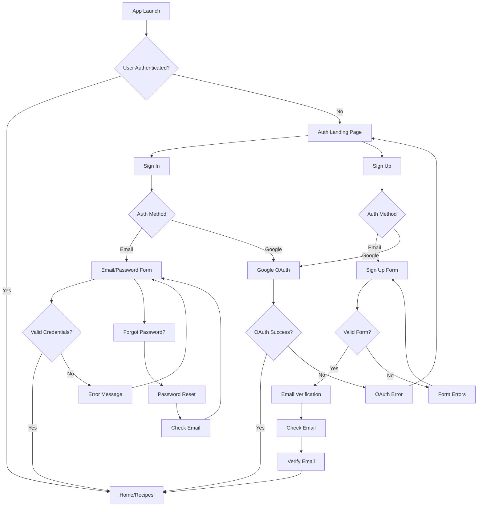

# Authentication UX Flow Design

## User Journey Map



## Screen Designs

### 1. Auth Landing Page
**Purpose**: Entry point for unauthenticated users

**Layout**:
```
┌─────────────────────────────┐
│       [App Logo]            │
│                             │
│    Welcome to Recipe App    │
│                             │
│  ┌───────────────────────┐  │
│  │   Continue with Email  │  │
│  └───────────────────────┘  │
│                             │
│  ┌───────────────────────┐  │
│  │  Continue with Google  │  │
│  └───────────────────────┘  │
│                             │
│  ──────── OR ────────       │
│                             │
│  Already have an account?   │
│       [Sign In]             │
└─────────────────────────────┘
```

**Interactions**:
- "Continue with Email" → Sign Up Page
- "Continue with Google" → Google OAuth
- "Sign In" → Sign In Page

### 2. Sign In Page
**Purpose**: Authenticate existing users

**Layout**:
```
┌─────────────────────────────┐
│  ← Back     Sign In         │
├─────────────────────────────┤
│                             │
│  Welcome back!              │
│                             │
│  ┌───────────────────────┐  │
│  │ Email                 │  │
│  └───────────────────────┘  │
│                             │
│  ┌───────────────────────┐  │
│  │ Password              │  │
│  └───────────────────────┘  │
│                             │
│  [Forgot Password?]         │
│                             │
│  ┌───────────────────────┐  │
│  │      Sign In          │  │
│  └───────────────────────┘  │
│                             │
│  ──────── OR ────────       │
│                             │
│  ┌───────────────────────┐  │
│  │  Sign in with Google  │  │
│  └───────────────────────┘  │
│                             │
│  Don't have an account?     │
│       [Sign Up]             │
└─────────────────────────────┘
```

**Validation**:
- Email: Valid email format
- Password: Not empty
- Show inline errors

### 3. Sign Up Page
**Purpose**: Register new users

**Layout**:
```
┌─────────────────────────────┐
│  ← Back     Sign Up         │
├─────────────────────────────┤
│                             │
│  Create your account        │
│                             │
│  ┌───────────────────────┐  │
│  │ Email                 │  │
│  └───────────────────────┘  │
│                             │
│  ┌───────────────────────┐  │
│  │ Password              │  │
│  └───────────────────────┘  │
│                             │
│  ┌───────────────────────┐  │
│  │ Confirm Password      │  │
│  └───────────────────────┘  │
│                             │
│  □ I agree to the Terms    │
│    of Service               │
│                             │
│  ┌───────────────────────┐  │
│  │     Create Account    │  │
│  └───────────────────────┘  │
│                             │
│  ──────── OR ────────       │
│                             │
│  ┌───────────────────────┐  │
│  │  Sign up with Google  │  │
│  └───────────────────────┘  │
│                             │
│  Already have an account?   │
│       [Sign In]             │
└─────────────────────────────┘
```

**Validation**:
- Email: Valid format, not already registered
- Password: Min 8 chars, strength indicator
- Confirm: Matches password
- Terms: Must be checked

### 4. Email Verification Page
**Purpose**: Confirm email ownership

**Layout**:
```
┌─────────────────────────────┐
│      Verify Your Email      │
├─────────────────────────────┤
│                             │
│        [Email Icon]         │
│                             │
│  We've sent a verification  │
│  email to:                  │
│                             │
│  user@example.com           │
│                             │
│  Please check your inbox    │
│  and click the link to      │
│  verify your account.       │
│                             │
│  ┌───────────────────────┐  │
│  │    Resend Email       │  │
│  └───────────────────────┘  │
│                             │
│  ┌───────────────────────┐  │
│  │  Open Email App       │  │
│  └───────────────────────┘  │
│                             │
│  [Change Email Address]     │
└─────────────────────────────┘
```

### 5. Password Reset Page
**Purpose**: Initiate password recovery

**Layout**:
```
┌─────────────────────────────┐
│  ← Back   Reset Password    │
├─────────────────────────────┤
│                             │
│  Forgot your password?      │
│                             │
│  Enter your email address   │
│  and we'll send you a link  │
│  to reset it.               │
│                             │
│  ┌───────────────────────┐  │
│  │ Email                 │  │
│  └───────────────────────┘  │
│                             │
│  ┌───────────────────────┐  │
│  │   Send Reset Link     │  │
│  └───────────────────────┘  │
│                             │
│  Remember your password?    │
│       [Sign In]             │
└─────────────────────────────┘
```

## Component Specifications

### Social Auth Button
```dart
SocialAuthButton(
  provider: 'google',
  icon: Icon(Icons.google),
  label: 'Continue with Google',
  onPressed: () => handleGoogleAuth(),
)
```

**States**:
- Default: White background, provider colors
- Pressed: Slight scale down
- Loading: Show spinner
- Disabled: Grayed out

### Auth Form Field
```dart
AuthFormField(
  label: 'Email',
  hint: 'your@email.com',
  keyboardType: TextInputType.emailAddress,
  validator: emailValidator,
  errorText: 'Please enter a valid email',
)
```

**Features**:
- Adaptive styling (iOS/Android)
- Real-time validation
- Clear error messages
- Password visibility toggle

## Loading States

### Full Screen Loading
Used during OAuth redirects and initial auth checks
```
┌─────────────────────────────┐
│                             │
│                             │
│                             │
│     [Spinner Animation]     │
│                             │
│      Signing you in...      │
│                             │
│                             │
│                             │
└─────────────────────────────┘
```

### Button Loading
Used for form submissions
```
┌───────────────────────┐
│  [Spinner] Loading... │
└───────────────────────┘
```

## Error Handling

### Error Dialog
```
┌─────────────────────────────┐
│        Sign In Error        │
├─────────────────────────────┤
│                             │
│  The email or password you  │
│  entered is incorrect.      │
│                             │
│  ┌───────────────────────┐  │
│  │         OK            │  │
│  └───────────────────────┘  │
└─────────────────────────────┘
```

### Inline Errors
- Show below relevant field
- Red text color
- Clear on field edit

## Success States

### Sign In Success
- Immediate navigation to home
- No success message needed

### Sign Up Success
- Navigate to email verification
- Show confirmation message

### Password Reset Success
```
┌─────────────────────────────┐
│      Check Your Email       │
├─────────────────────────────┤
│                             │
│        [Check Icon]         │
│                             │
│  We've sent password reset  │
│  instructions to:           │
│                             │
│  user@example.com           │
│                             │
│  ┌───────────────────────┐  │
│  │   Back to Sign In     │  │
│  └───────────────────────┘  │
└─────────────────────────────┘
```

## Accessibility

### Screen Reader Support
- All buttons have labels
- Form fields have descriptions
- Error messages announced
- Loading states communicated

### Keyboard Navigation
- Tab order logical
- Enter submits forms
- Escape cancels dialogs
- Focus indicators visible

### Color Contrast
- WCAG AA compliant
- Error states not just color
- Success states have icons
- Loading states have text

## Platform Differences

### iOS
- Use CupertinoTextField
- CupertinoButton styling
- Native activity indicators
- Slide transitions

### Android
- Use Material TextFields
- Material button styling
- Circular progress indicators
- Fade transitions

### Adaptive Components
All auth components adapt automatically based on platform while maintaining consistent functionality and user flow.