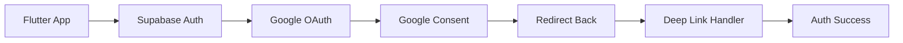

# Google Sign-In Integration Guide

## Overview

This guide details the complete Google Sign-In integration with Supabase for the Flutter Recipe App. We'll use Supabase's built-in OAuth functionality which handles the OAuth flow without requiring the `google_sign_in` Flutter package.

## Integration Architecture



## Configuration Steps

### 1. Google Cloud Platform Setup

#### Create OAuth 2.0 Credentials
1. Go to [Google Cloud Console](https://console.cloud.google.com)
2. Select your project (or create new)
3. Navigate to "APIs & Services" > "Credentials"
4. Click "Create Credentials" > "OAuth client ID"

#### Web Application Client
```
Application type: Web application
Name: Recipe App Web Client
Authorized redirect URIs:
- https://<project-ref>.supabase.co/auth/v1/callback
```

#### iOS Client (if native implementation needed)
```
Application type: iOS
Name: Recipe App iOS
Bundle ID: io.supabase.flutterrecipeapp
```

#### Android Client (if native implementation needed)
```
Application type: Android
Name: Recipe App Android
Package name: io.supabase.flutterrecipeapp
SHA-1 certificate fingerprint: [Your SHA-1]
```

### 2. Supabase Configuration

#### Enable Google Provider
1. Go to Supabase Dashboard > Authentication > Providers
2. Enable Google
3. Add credentials:
   - **Client ID**: From GCP Web Application
   - **Client Secret**: From GCP Web Application
4. Authorized Client IDs (for mobile):
   - Add iOS client ID
   - Add Android client ID

#### Configure Redirect URLs
Add these to Supabase settings:
```
io.supabase.flutterrecipeapp://login-callback/
http://localhost:3000/auth/callback
```

### 3. Flutter App Configuration

#### iOS Setup (`ios/Runner/Info.plist`)
```xml
<?xml version="1.0" encoding="UTF-8"?>
<!DOCTYPE plist PUBLIC "-//Apple//DTD PLIST 1.0//EN" "http://www.apple.com/DTDs/PropertyList-1.0.dtd">
<plist version="1.0">
<dict>
    <!-- Other configurations -->
    
    <!-- URL Scheme for Supabase OAuth -->
    <key>CFBundleURLTypes</key>
    <array>
        <dict>
            <key>CFBundleURLSchemes</key>
            <array>
                <string>io.supabase.flutterrecipeapp</string>
            </array>
            <key>CFBundleURLName</key>
            <string>io.supabase.flutterrecipeapp</string>
        </dict>
    </array>
    
    <!-- Required for OAuth web view -->
    <key>LSApplicationQueriesSchemes</key>
    <array>
        <string>https</string>
        <string>http</string>
    </array>
</dict>
</plist>
```

#### Android Setup (`android/app/src/main/AndroidManifest.xml`)
```xml
<manifest xmlns:android="http://schemas.android.com/apk/res/android">
    <application>
        <!-- Other configurations -->
        
        <activity
            android:name=".MainActivity"
            android:launchMode="singleTop">
            
            <!-- OAuth Redirect Intent Filter -->
            <intent-filter>
                <action android:name="android.intent.action.VIEW" />
                <category android:name="android.intent.category.DEFAULT" />
                <category android:name="android.intent.category.BROWSABLE" />
                
                <data
                    android:scheme="io.supabase.flutterrecipeapp"
                    android:host="login-callback" />
            </intent-filter>
        </activity>
    </application>
</manifest>
```

## Implementation Code

### Auth Service Enhancement
```dart
import 'dart:io';
import 'package:supabase_flutter/supabase_flutter.dart';
import 'package:url_launcher/url_launcher.dart';

class AuthService {
  final SupabaseClient _supabase;
  
  AuthService(this._supabase);
  
  /// Initiates Google Sign-In flow
  Future<bool> signInWithGoogle() async {
    try {
      final result = await _supabase.auth.signInWithOAuth(
        OAuthProvider.google,
        redirectTo: _getRedirectUrl(),
        scopes: 'email profile', // Request specific scopes
        queryParams: {
          'access_type': 'offline', // For refresh token
          'prompt': 'consent', // Always show consent screen
        },
      );
      
      return result;
    } catch (e) {
      debugPrint('Google Sign-In Error: $e');
      return false;
    }
  }
  
  /// Gets platform-specific redirect URL
  String _getRedirectUrl() {
    if (Platform.isIOS || Platform.isAndroid) {
      // Mobile deep link
      return 'io.supabase.flutterrecipeapp://login-callback/';
    } else if (Platform.isMacOS || Platform.isWindows || Platform.isLinux) {
      // Desktop redirect
      return 'http://localhost:3000/auth/callback';
    } else {
      // Web redirect
      return '${_supabase.auth.redirectTo}/auth/callback';
    }
  }
}
```

### Google Sign-In Button Widget
```dart
import 'package:flutter/cupertino.dart';
import 'package:flutter/material.dart';

class GoogleSignInButton extends StatelessWidget {
  final VoidCallback onPressed;
  final bool isLoading;
  final String label;
  
  const GoogleSignInButton({
    super.key,
    required this.onPressed,
    this.isLoading = false,
    this.label = 'Sign in with Google',
  });
  
  @override
  Widget build(BuildContext context) {
    final isDarkMode = Theme.of(context).brightness == Brightness.dark;
    
    if (Platform.isIOS) {
      return _buildCupertinoButton(context, isDarkMode);
    } else {
      return _buildMaterialButton(context, isDarkMode);
    }
  }
  
  Widget _buildCupertinoButton(BuildContext context, bool isDarkMode) {
    return CupertinoButton(
      onPressed: isLoading ? null : onPressed,
      padding: const EdgeInsets.symmetric(horizontal: 20, vertical: 12),
      color: isDarkMode ? CupertinoColors.systemGrey : CupertinoColors.white,
      borderRadius: BorderRadius.circular(8),
      child: Row(
        mainAxisSize: MainAxisSize.min,
        children: [
          if (isLoading)
            const CupertinoActivityIndicator()
          else
            Image.asset(
              'assets/images/google_logo.png',
              height: 20,
              width: 20,
            ),
          const SizedBox(width: 12),
          Text(
            label,
            style: TextStyle(
              color: isDarkMode 
                  ? CupertinoColors.white 
                  : CupertinoColors.black,
              fontSize: 16,
              fontWeight: FontWeight.w500,
            ),
          ),
        ],
      ),
    );
  }
  
  Widget _buildMaterialButton(BuildContext context, bool isDarkMode) {
    return OutlinedButton(
      onPressed: isLoading ? null : onPressed,
      style: OutlinedButton.styleFrom(
        backgroundColor: isDarkMode ? Colors.grey[800] : Colors.white,
        side: BorderSide(
          color: isDarkMode ? Colors.grey[600]! : Colors.grey[300]!,
        ),
        padding: const EdgeInsets.symmetric(horizontal: 20, vertical: 12),
        shape: RoundedRectangleBorder(
          borderRadius: BorderRadius.circular(8),
        ),
      ),
      child: Row(
        mainAxisSize: MainAxisSize.min,
        children: [
          if (isLoading)
            const SizedBox(
              height: 20,
              width: 20,
              child: CircularProgressIndicator(strokeWidth: 2),
            )
          else
            Image.asset(
              'assets/images/google_logo.png',
              height: 20,
              width: 20,
            ),
          const SizedBox(width: 12),
          Text(
            label,
            style: TextStyle(
              color: isDarkMode ? Colors.white : Colors.black87,
              fontSize: 16,
              fontWeight: FontWeight.w500,
            ),
          ),
        ],
      ),
    );
  }
}
```

### Deep Link Handler
```dart
import 'package:app_links/app_links.dart';

class DeepLinkHandler {
  late AppLinks _appLinks;
  StreamSubscription<Uri>? _linkSubscription;
  
  void initDeepLinks() {
    _appLinks = AppLinks();
    
    // Handle initial link if app was launched from a deep link
    _handleInitialLink();
    
    // Handle links when app is already open
    _linkSubscription = _appLinks.uriLinkStream.listen((uri) {
      _handleDeepLink(uri);
    });
  }
  
  Future<void> _handleInitialLink() async {
    try {
      final initialLink = await _appLinks.getInitialAppLink();
      if (initialLink != null) {
        _handleDeepLink(initialLink);
      }
    } catch (e) {
      debugPrint('Failed to handle initial link: $e');
    }
  }
  
  void _handleDeepLink(Uri uri) {
    // Check if this is an auth callback
    if (uri.scheme == 'io.supabase.flutterrecipeapp' && 
        uri.host == 'login-callback') {
      // Supabase will handle the auth callback automatically
      debugPrint('Auth callback received: $uri');
    }
  }
  
  void dispose() {
    _linkSubscription?.cancel();
  }
}
```

## Error Handling

### Common Google Sign-In Errors

#### 1. User Cancelled
```dart
// Handled in auth state listener
if (event == AuthChangeEvent.signedIn && session == null) {
  // User cancelled the sign-in
  showError('Sign-in was cancelled');
}
```

#### 2. Network Error
```dart
try {
  await signInWithGoogle();
} on SocketException {
  showError('No internet connection');
} catch (e) {
  showError('Failed to sign in with Google');
}
```

#### 3. Configuration Error
```dart
// Add validation in auth service
Future<bool> validateGoogleSignInConfig() async {
  try {
    // Check if redirect URL is properly configured
    final redirectUrl = _getRedirectUrl();
    if (redirectUrl.isEmpty) {
      throw Exception('Redirect URL not configured');
    }
    
    // Verify Supabase project has Google provider enabled
    // This would be done via Supabase admin API if available
    
    return true;
  } catch (e) {
    debugPrint('Google Sign-In config error: $e');
    return false;
  }
}
```

## Testing Checklist

### Configuration Testing
- [ ] GCP OAuth credentials created
- [ ] Supabase Google provider enabled
- [ ] Client ID and Secret added to Supabase
- [ ] Redirect URLs configured
- [ ] iOS URL scheme added
- [ ] Android intent filter added

### Functionality Testing
- [ ] Google sign-in button appears
- [ ] Clicking button opens Google consent
- [ ] Consent screen shows correct app name
- [ ] Successful auth redirects back to app
- [ ] User data is properly stored
- [ ] Session is maintained across app restarts
- [ ] Sign out works correctly

### Error Case Testing
- [ ] User cancels consent
- [ ] Network error handling
- [ ] Invalid configuration handling
- [ ] Duplicate account handling
- [ ] Token refresh works

### Platform Testing
- [ ] iOS Simulator
- [ ] iOS Device
- [ ] Android Emulator
- [ ] Android Device
- [ ] Web Browser
- [ ] macOS (if applicable)

## Security Considerations

### Best Practices
1. **Never expose client secret in mobile apps**
   - Use only client ID in mobile
   - Client secret stays in Supabase backend

2. **Validate redirect URLs**
   - Use exact URL matching
   - No wildcards in production

3. **Scope Management**
   - Request only necessary scopes
   - Default: email, profile

4. **Token Storage**
   - Supabase handles secure token storage
   - Don't store tokens manually

5. **PKCE Flow**
   - Supabase implements PKCE for mobile OAuth
   - Adds extra security layer

## Troubleshooting

### Debug Mode Logging
```dart
// Enable verbose logging
Supabase.initialize(
  url: supabaseUrl,
  anonKey: supabaseAnonKey,
  debug: true, // Enable debug logs
);
```

### Common Issues

1. **"Redirect URI mismatch"**
   - Verify exact URL in GCP matches Supabase
   - Check for trailing slashes

2. **"Invalid client"**
   - Ensure client ID is correct
   - Check if OAuth client is enabled

3. **App doesn't return after consent**
   - Verify URL scheme in app config
   - Check deep link configuration

4. **"This app isn't verified"**
   - Normal for development
   - Need OAuth consent screen review for production