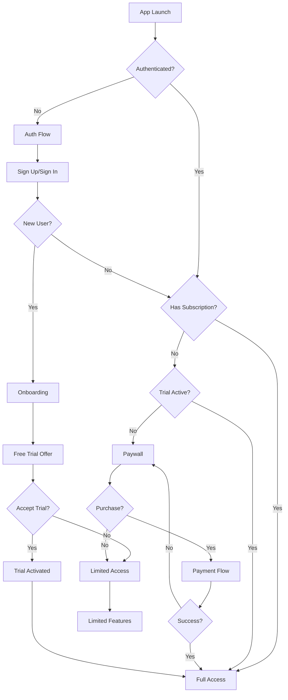

# Auth & Paywall Integration Strategy

## Overview

This document outlines how the authentication system will integrate with future paywall and subscription features. The design ensures a smooth user journey from sign-up through subscription purchase.

## User Journey with Paywall



## Integration Architecture

### 1. User Metadata Structure
```typescript
interface UserMetadata {
  // Basic user info
  displayName?: string;
  avatar?: string;
  
  // Subscription data
  subscription: {
    status: 'none' | 'trial' | 'active' | 'expired' | 'cancelled';
    plan?: 'basic' | 'pro' | 'premium';
    trialEndsAt?: string;
    expiresAt?: string;
    purchaseSource?: 'ios' | 'android' | 'web';
  };
  
  // Feature flags
  features: {
    unlimitedRecipes: boolean;
    advancedFeatures: boolean;
    offlineSync: boolean;
    familySharing: boolean;
  };
  
  // Analytics
  onboardingCompleted: boolean;
  firstRecipeCreated: boolean;
}
```

### 2. Auth Completion Hook
```dart
class AuthCompletionHandler {
  final SupabaseClient _supabase;
  final PaywallService _paywall;
  final UserRepository _userRepo;
  
  Future<void> handleAuthSuccess(User user) async {
    // 1. Check if new user
    final isNewUser = await _checkIfNewUser(user);
    
    // 2. Load user metadata
    final metadata = await _loadUserMetadata(user.id);
    
    // 3. Determine next action
    if (isNewUser) {
      await _handleNewUser(user);
    } else {
      await _handleReturningUser(user, metadata);
    }
  }
  
  Future<void> _handleNewUser(User user) async {
    // Create user profile
    await _userRepo.createUserProfile(user);
    
    // Navigate to onboarding
    router.go('/onboarding');
  }
  
  Future<void> _handleReturningUser(User user, UserMetadata metadata) async {
    // Check subscription status
    final needsPaywall = _shouldShowPaywall(metadata);
    
    if (needsPaywall) {
      router.go('/paywall');
    } else {
      router.go('/recipes');
    }
  }
  
  bool _shouldShowPaywall(UserMetadata metadata) {
    // Show paywall if:
    // - No active subscription
    // - Trial expired
    // - Subscription expired
    return metadata.subscription.status == 'none' ||
           metadata.subscription.status == 'expired';
  }
}
```

## Paywall Trigger Points

### 1. Post-Authentication
- **When**: After successful sign-up or sign-in
- **Condition**: No active subscription or trial
- **Experience**: Full-screen paywall with benefits

### 2. Feature Gating
- **When**: User tries premium feature
- **Condition**: Feature requires subscription
- **Experience**: Modal paywall with context

### 3. Trial Expiration
- **When**: Free trial ends
- **Condition**: No conversion to paid
- **Experience**: Soft paywall with limited access

### 4. Usage Limits
- **When**: User hits free tier limits
- **Condition**: e.g., 10 recipes max
- **Experience**: Upgrade prompt with clear benefits

## Implementation Approach

### Phase 1: Auth with Metadata Foundation
```dart
// Extend auth service to include metadata
class EnhancedAuthService extends AuthService {
  Future<AuthResponse> signUpWithEmail({
    required String email,
    required String password,
    Map<String, dynamic>? metadata,
  }) async {
    // Add default metadata for new users
    final enrichedMetadata = {
      'subscription': {
        'status': 'none',
        'features': {
          'unlimitedRecipes': false,
          'advancedFeatures': false,
          'offlineSync': true, // Free during launch
          'familySharing': false,
        },
      },
      'onboardingCompleted': false,
      ...?metadata,
    };
    
    return await _supabase.auth.signUp(
      email: email,
      password: password,
      data: enrichedMetadata,
    );
  }
}
```

### Phase 2: Subscription Service
```dart
@riverpod
class SubscriptionService extends _$SubscriptionService {
  @override
  Future<SubscriptionState> build() async {
    // Load subscription from user metadata
    final user = _supabase.auth.currentUser;
    if (user == null) return SubscriptionState.none();
    
    final metadata = UserMetadata.fromJson(user.userMetadata);
    return SubscriptionState.fromMetadata(metadata);
  }
  
  Future<void> checkSubscriptionStatus() async {
    // Verify with payment provider (RevenueCat, etc.)
    final status = await _paymentProvider.getSubscriptionStatus();
    
    // Update user metadata if changed
    if (status != state.value?.status) {
      await _updateSubscriptionMetadata(status);
    }
  }
  
  Future<void> startFreeTrial() async {
    final trialEndsAt = DateTime.now().add(Duration(days: 7));
    
    await _supabase.auth.updateUser(
      UserAttributes(
        data: {
          'subscription': {
            'status': 'trial',
            'trialEndsAt': trialEndsAt.toIso8601String(),
          },
        },
      ),
    );
    
    // Refresh state
    ref.invalidateSelf();
  }
}
```

### Phase 3: Paywall UI Components
```dart
class PaywallScreen extends ConsumerWidget {
  @override
  Widget build(BuildContext context, WidgetRef ref) {
    final subscription = ref.watch(subscriptionServiceProvider);
    
    return AdaptiveSliverPage(
      title: 'Unlock Premium Features',
      body: Column(
        children: [
          // Hero section
          _buildHeroSection(),
          
          // Benefits list
          _buildBenefitsList(),
          
          // Pricing options
          _buildPricingOptions(subscription),
          
          // CTA buttons
          _buildCTAButtons(context, ref),
          
          // Restore purchases
          _buildRestoreButton(ref),
        ],
      ),
    );
  }
}
```

## Deep Linking for Purchase Flow

### URL Schemes
```
// Success callback
io.supabase.flutterrecipeapp://purchase-success?product_id=pro_monthly

// Cancellation callback  
io.supabase.flutterrecipeapp://purchase-cancelled

// Restore callback
io.supabase.flutterrecipeapp://restore-complete
```

### Route Configuration
```dart
GoRoute(
  path: '/purchase-success',
  redirect: (context, state) async {
    // Update subscription status
    await ref.read(subscriptionServiceProvider.notifier)
        .handlePurchaseSuccess(state.queryParams);
    
    // Navigate to success screen or home
    return '/recipes';
  },
),
```

## Analytics Integration

### Key Events
```dart
class PaywallAnalytics {
  // Paywall display
  static void trackPaywallView({
    required String source,
    required String variant,
  }) {
    analytics.track('paywall_viewed', {
      'source': source, // 'post_auth', 'feature_gate', etc.
      'variant': variant, // A/B test variant
      'user_status': 'new' | 'returning',
    });
  }
  
  // Purchase flow
  static void trackPurchaseStarted(String productId) {
    analytics.track('purchase_started', {
      'product_id': productId,
      'price': price,
      'currency': currency,
    });
  }
  
  // Conversion
  static void trackPurchaseCompleted(String productId) {
    analytics.track('purchase_completed', {
      'product_id': productId,
      'revenue': revenue,
    });
  }
}
```

## Free Tier Limitations

### Feature Restrictions
```dart
class FeatureGates {
  static const Map<String, FeatureRequirement> features = {
    'unlimited_recipes': FeatureRequirement(
      freeLimit: 10,
      requiresPlan: ['pro', 'premium'],
    ),
    'advanced_search': FeatureRequirement(
      freeLimit: 0,
      requiresPlan: ['pro', 'premium'],
    ),
    'meal_planning': FeatureRequirement(
      freeLimit: 1, // 1 week ahead
      requiresPlan: ['premium'],
    ),
    'family_sharing': FeatureRequirement(
      freeLimit: 0,
      requiresPlan: ['premium'],
    ),
  };
  
  static bool canAccess(String feature, SubscriptionState subscription) {
    final requirement = features[feature];
    if (requirement == null) return true;
    
    if (subscription.plan != null && 
        requirement.requiresPlan.contains(subscription.plan)) {
      return true;
    }
    
    return subscription.usage[feature] < requirement.freeLimit;
  }
}
```

## Migration Strategy

### Existing Users
1. **Grandfather Period**: Existing users keep current access
2. **Soft Introduction**: Show benefits without forcing paywall
3. **Gradual Rollout**: A/B test paywall with % of users
4. **Communication**: Email campaign about new premium features

### Database Schema Updates
```sql
-- Add subscription tracking
ALTER TABLE users ADD COLUMN subscription_status TEXT DEFAULT 'none';
ALTER TABLE users ADD COLUMN subscription_plan TEXT;
ALTER TABLE users ADD COLUMN trial_ends_at TIMESTAMP;
ALTER TABLE users ADD COLUMN subscription_expires_at TIMESTAMP;

-- Usage tracking
CREATE TABLE usage_metrics (
  id UUID PRIMARY KEY DEFAULT uuid_generate_v4(),
  user_id UUID REFERENCES users(id),
  feature TEXT NOT NULL,
  count INTEGER DEFAULT 0,
  period_start TIMESTAMP DEFAULT NOW(),
  period_end TIMESTAMP,
  UNIQUE(user_id, feature, period_start)
);
```

## Testing Strategy

### Test Scenarios
1. **New User Flow**
   - Sign up → Onboarding → Trial offer → Accept/Decline
   
2. **Returning Free User**
   - Sign in → Check limits → Show upgrade prompts
   
3. **Expired Trial User**
   - Sign in → Trial expired notice → Paywall
   
4. **Premium User**
   - Sign in → Full access → No interruptions

### Test Accounts
```dart
// Test user metadata
const testUsers = {
  'free_user@test.com': {
    'subscription': {'status': 'none'},
  },
  'trial_user@test.com': {
    'subscription': {
      'status': 'trial',
      'trialEndsAt': '2024-12-31',
    },
  },
  'premium_user@test.com': {
    'subscription': {
      'status': 'active',
      'plan': 'premium',
    },
  },
};
```

## Success Metrics

1. **Conversion Funnel**
   - Sign-up to trial: >50%
   - Trial to paid: >30%
   - Paywall view to purchase: >5%

2. **User Experience**
   - Auth completion time: <5s
   - Paywall load time: <1s
   - Purchase completion: <30s

3. **Technical Metrics**
   - Auth error rate: <1%
   - Purchase failure rate: <2%
   - Subscription sync accuracy: >99%