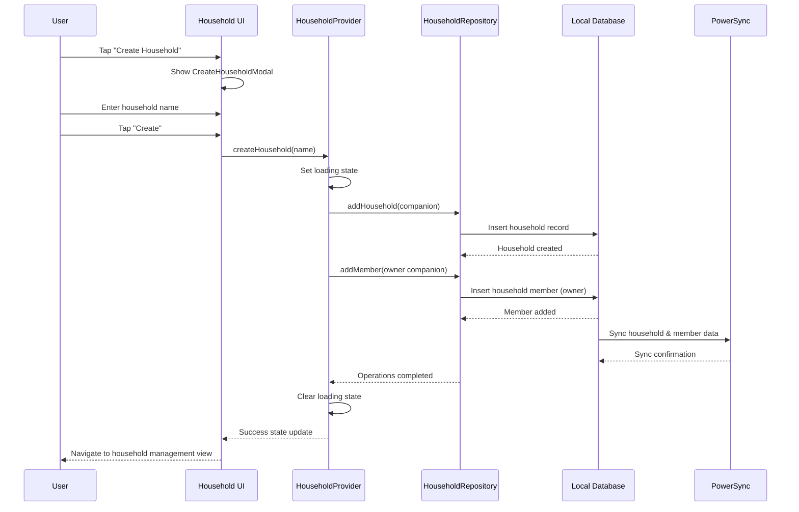
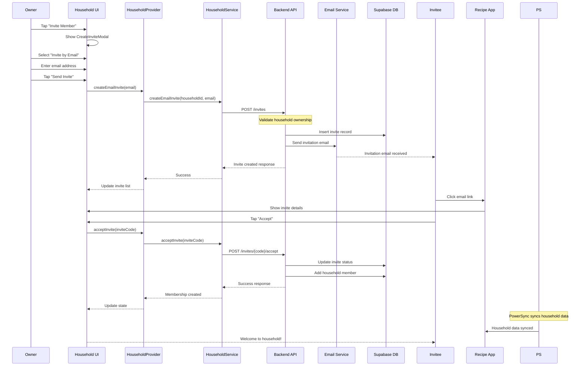
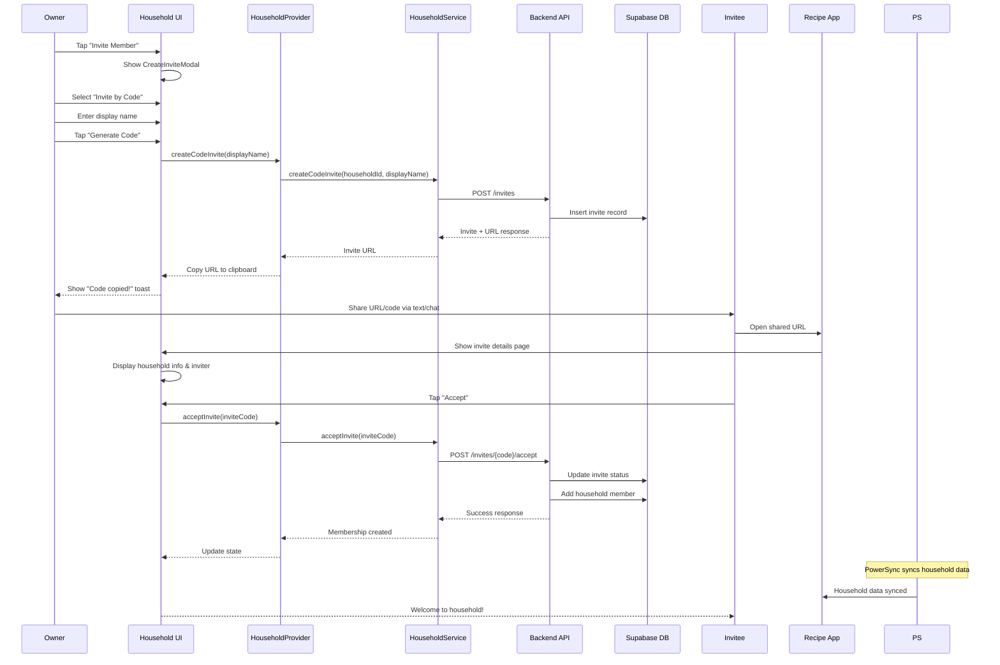
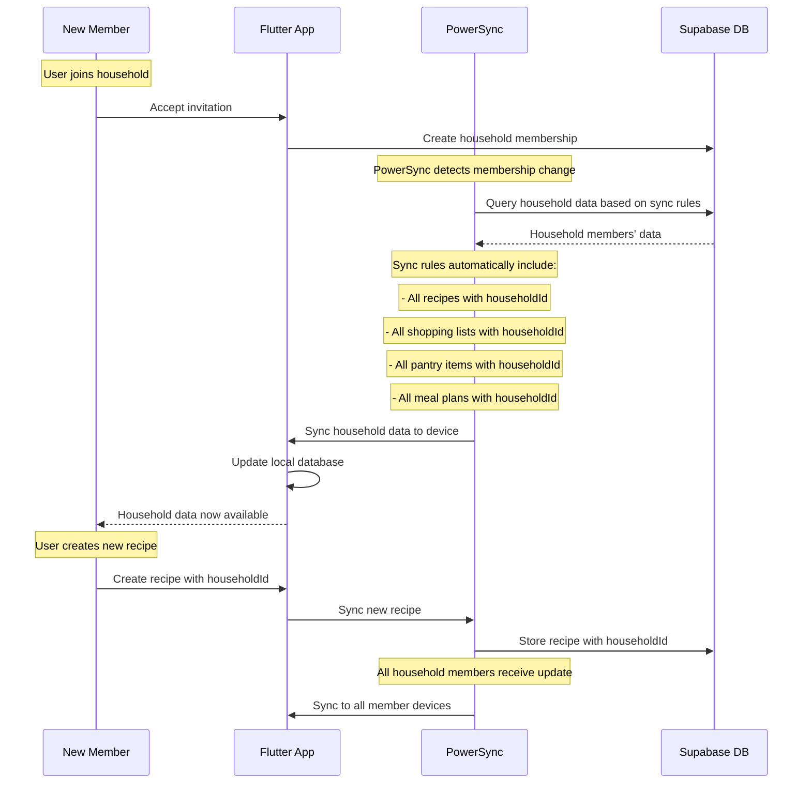
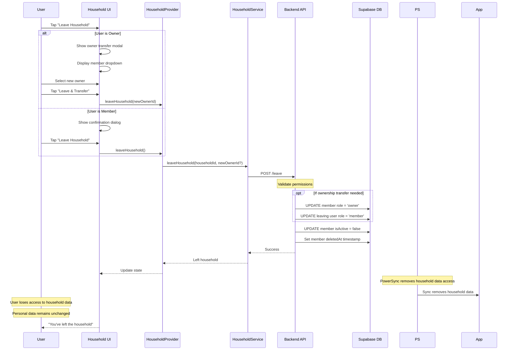
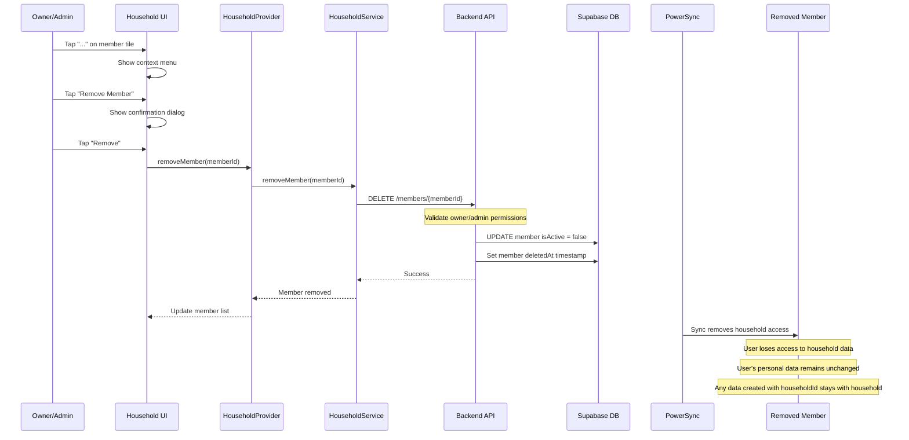
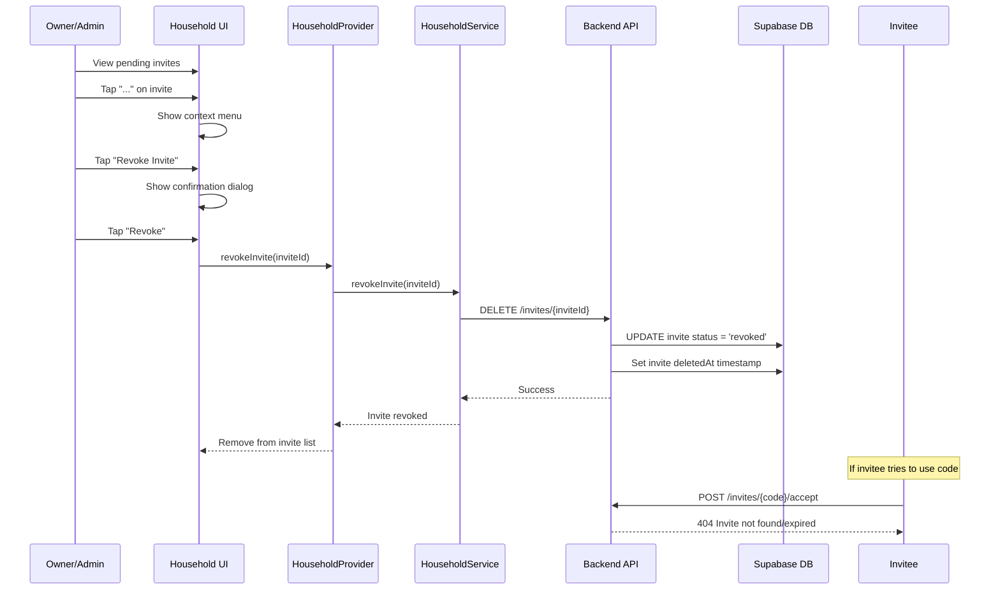
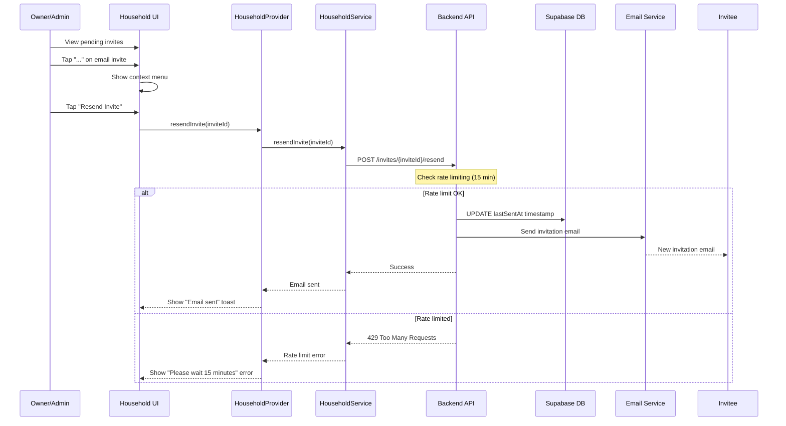
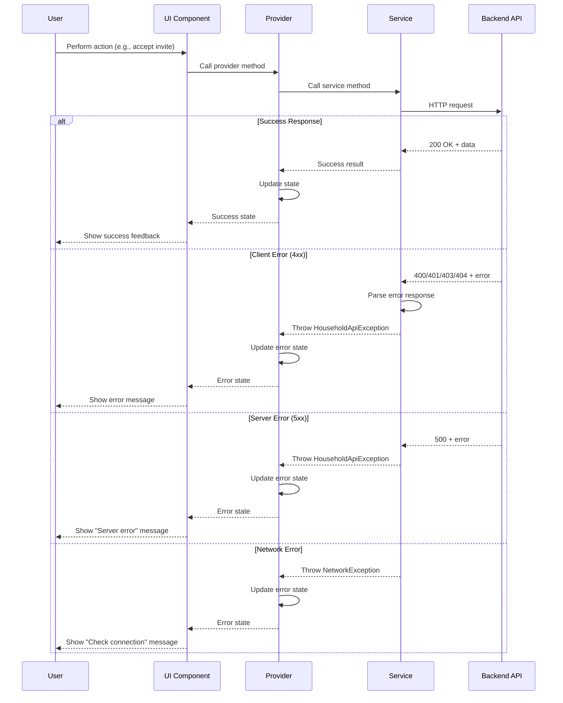
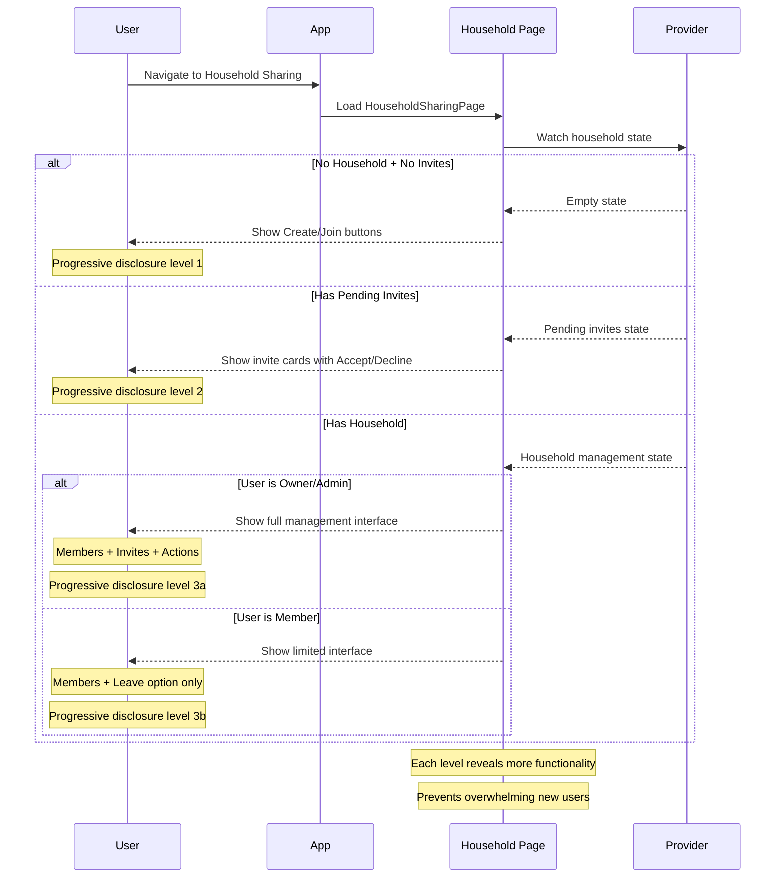

# Household Management Sequence Diagrams

This document contains Mermaid sequence diagrams for the key household management workflows.

## 1. Create Household Flow

## 2. Email Invitation Flow

## 3. Code Invitation Flow

## 4. PowerSync Data Synchronization

## 5. Leave Household Flow

## 6. Remove Member Flow

## 7. Revoke Invitation Flow

## 8. Resend Email Invitation

## 9. Error Handling Flow

## 10. Progressive Disclosure UX Flow

## Key Design Principles

### 1. Progressive Disclosure
- Start with simple Create/Join options
- Gradually reveal more complex features
- Role-based feature visibility

### 2. Async Operations
- All API calls are asynchronous
- Progress indicators for long operations
- Graceful error handling

### 3. Data Consistency
- PowerSync handles offline/online sync
- Optimistic UI updates where safe
- Rollback capability for failures

### 4. Security First
- All operations validate permissions
- Rate limiting prevents abuse
- Audit trails for sensitive actions

### 5. User Experience
- Clear feedback for all actions
- Confirmation dialogs for destructive operations
- Helpful error messages with recovery actions

These sequence diagrams provide a comprehensive view of how the household management system works across all the major user flows, showing the interaction between frontend components, backend services, and data persistence layers.